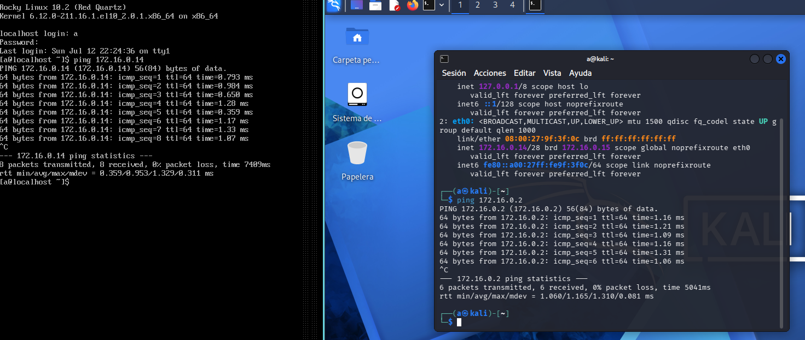

# Design Decisions

This document is for the planification of the project. It has:

- Hardware and Hardware Limitations.
- Why Virtualbox over Proxmox and assumed limitations.
- Why Kali instead of BlackArch.
- What is Virtualbox's Internal Network and Why I will use it.

## Hardware and Hardware Limitations.

- CPU: Intel(R) Core(TM) i5-10300H CPU @ 2.50GHz
- Storage: 1 250GB SSD to hold the main system + 1TB HDD storage.
- RAM: 24GB
- Victim System: Windows 10/11, Windows Server, Rocky Linux
- Attacking System: Kali Linux
- Hypervisor: Virtualbox on Pop!OS

## Why Virtualbox over Proxmox and assumed limitations.

Because of my limits in knowledge over Virtualization I'm using what I know, which is Virtualbox.
While I know that this means my virtual machines are going to compete with my main system over the resources.
The 24GB of Ram and 250GB SSD storage are going to be distributed and not only used for the virtual machines.
In the future, I will migrate the systems over to Proxmox to make sure there is no competing over resources.

## Why Kali Linux instead of BlackArch?

The business standar for every academy (HTB, TryHackMe as examples) are Debian GNU/Linux based distributions.
For this same purpose and because of the sheer amount of tools the attacking system will be Kali Linux, as
this is the most used system for pentesting and ethical hacking.
On the other hand there's BlackArch, which is based on Arch. This mean that the tools, repositories and
even the package management tools won't be the same, as Arch is it's own thing that means that, to use it
one needs to learn all the new commands to make it work.

Conclusion: While BlackArch has potential, because of the standart that is Kali Linux and other Debian based
linux distribution, I'll be using Kali Linux.

## What is Virtualbox's Internal Network and Why I will use it.

As I'll be using my main system and my own home network as my homelab, that means I need a separation from
the attacked network as to no infect other computers or devices connected to the same network as me.
Virtualbox offers several network modes for all its virtual machines:

- NAT
- Bridged
- Internal Network
- Host-only

The focus will be on Internal Network. This creates a network that exists only between the virtual machines
that I choose without touching my physical interface or my home network.
If I had to summarize it in a quote it would be "It's the difference between 'my testing malware can try and
get out to the internet or touch my physical router' and 'My testing malware it's locked inside a closed box
which I'm the only one able to open it'"

## Network Design.

As talked previously I need a different network from the one I'm using on my own house for this lab. So the
question is:
Which network IP and subnet masks do I use?

The problem is that most regular subnet masks are for many devices, and this homelab needs at max 6 devices.
The answer: /28 subnet mask. 255.255.255.240
And besides that a different IP from a domestic networks. Most domestic networks are already on 192.168.1.0/24
And to that I decided on a network design of 172.16.0.0

There, the network was completely isolated from my home network, not only by configuration (Internal network)
but also by assigned IP.

So the following diagram appeared:

- 172.16.0.1 for the gateway.
- 172.16.0.2 for the Linux victim virtual machine.
- 172.16.0.3 for the Victim Windows server.
- 172.16.0.8 for the Victim Windows user.
- 172.16.0.10 for the SIEM machine
- 172.16.0.14 for the Attacking Linux.

Again, in prevision of possible leaks of testing malware, all virtual machines are designated with an
Internal Network networking configuration as to keep any risk far from the internet and/or the domestic devices
in my network.

## Lab Status

This is the status of the lab at the most updated current status.

- Rocky Linux machine - Victim Linux - IP: 172.16.0.2/28 - Operational
- Kali Linux machine - Attacker Linux - IP 172.16.0.14/28 - Operational
- Connection verified through bidirectional ping. No package lost and response in less than 2.00 ms.

