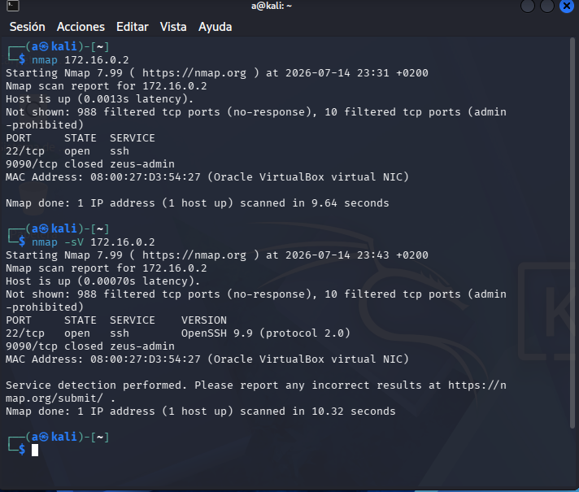

# Nmap Reconnaisance Report

## Objective

This document's objective is to show my reports on network scans, findings, findings and vulnerabilities.
With the possible perspective of an attacker and a defender to adjust little by little to a Blue Team
member's perspective.

## Date and Scan Objectives

- July 14th - ports scanned over Rocky Linux host (172.16.0.2)

## Executed Command Line.

- nmap 172.16.0.2
- nmap -sV 172.16.0.2

## Results and Findings

- The result of a regular nmap execution over host 172.16.0.2 gave me the following results over their
possible vulnerabilities. Firsthand the information was that the host was up and in the network, how many
ports were unresponsive (either unresponsive because they were not even active or because they were
prohibited over admin privileges).

Next was the ports, state and services available and possibly explotable, which were port 22 and port 9090.
The first of all was 22, responsive to tcp protocol. It was open and affected service SSH. Knowing this is
SSH default port it meant an easy door to exploit.

The other port was 9090, responsive to tcp but closed.

After that the report gave the following info:(MAC address, brand/who built the device and how many hosts
were scanned in how many seconds).

- The execution of nmap -sV over the host gave me the same info as regular nmap, but it also gave me the
version of the SSH service (openSSH 9.9) and the version of the protocol (Protocol 2.0).

## Analisis as Attacker and Defender.

- Attacker's perspective: An attacker can hold on to the gathered info (port number of the open port, which
service is affected to which port and what version of both the service and protocol are used to try and
perform a known exploit over that version altogether.

The attacker can also hold on to the MAC address to perform other kind of exploits.

- Defender's perspective: SSH service as it's configured right now it's a huge vulnerability that has to be
remediated as soon as possible.
Knowing the service, port and version we can start by looking for CVEs associated with the version of
said service (OpenSSH 9.9) and the protocol it used (Protocol 2.0).

With the info gathered from the CVEs we can perform a first evaluation on criticality of said vulnerability
and finally escalate and patch said vulnerability (Either by upgrading, changing the configuration to another
one that is not the default port or even closing the service if it's not a needed service).

## Screenshots.

- July 14th report

