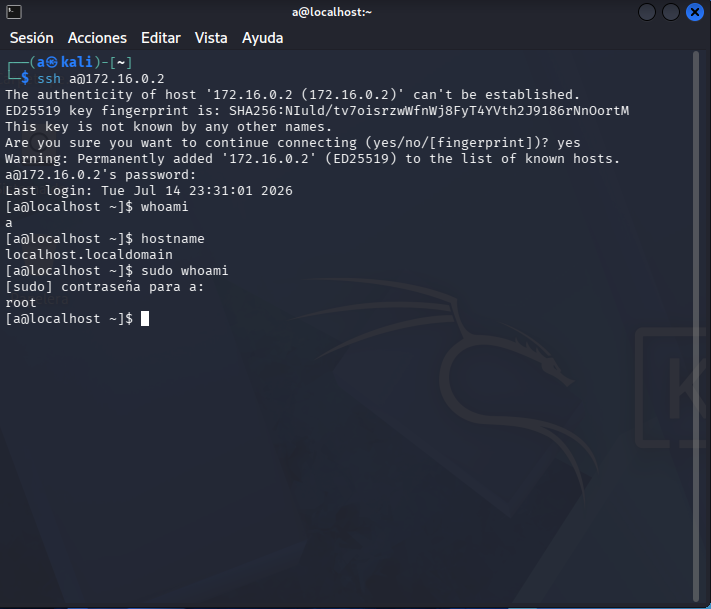

# Nmap Reconnaisance Report

## Objective

This document's objective is to show my reports on network scans, findings, findings and vulnerabilities.
With the possible perspective of an attacker and a defender to adjust little by little to a Blue Team
member's perspective.

## Date and Scan Objectives

- July 14th - ports scanned over Rocky Linux host (172.16.0.2)

## Executed Command Line.

- nmap 172.16.0.2
- nmap -sV 172.16.0.2

## Results and Findings

- The result of a regular nmap execution over host 172.16.0.2 gave me the following results over their
possible vulnerabilities. Firsthand the information was that the host was up and in the network, how many
ports were unresponsive (either unresponsive because they were not even active or because they were
prohibited over admin privileges).

Next was the ports, state and services available and possibly explotable, which were port 22 and port 9090.
The first of all was 22, responsive to tcp protocol. It was open and affected service SSH. Knowing this is
SSH default port it meant an easy door to exploit.

The other port was 9090, responsive to tcp but closed.

After that the report gave the following info:(MAC address, brand/who built the device and how many hosts
were scanned in how many seconds).

- The execution of nmap -sV over the host gave me the same info as regular nmap, but it also gave me the
version of the SSH service (openSSH 9.9) and the version of the protocol (Protocol 2.0).

## Analisis as Attacker and Defender.

- Attacker's perspective: An attacker can hold on to the gathered info (port number of the open port, which
service is affected to which port and what version of both the service and protocol are used to try and
perform a known exploit over that version altogether.

The attacker can also hold on to the MAC address to perform other kind of exploits.

- Defender's perspective: SSH service as it's configured right now it's a huge vulnerability that has to be
remediated as soon as possible.
Knowing the service, port and version we can start by looking for CVEs associated with the version of
said service (OpenSSH 9.9) and the protocol it used (Protocol 2.0).

With the info gathered from the CVEs we can perform a first evaluation on criticality of said vulnerability
and finally escalate and patch said vulnerability (Either by upgrading, changing the configuration to another
one that is not the default port or even closing the service if it's not a needed service).

## Screenshots.

- July 14th 2026 report

## SSH Access - Exploitation

This was perform as an exploit of SSH connection. This section will explain how it happened step by step
and how it was possible and the impact on a real environment.

- Used command to connect  was 'ssh a@172.16.0.2'

- Once the command was used the system asked for confirmation, since it was a first time connection. Once
confirmed because we said yes, it asked for the password directly, since we used the username already: 'a'
Once it confirmed the veracity of user and password, it allowed us to connect to the user, that we
checked: First if I really was the user I asked on SSH, second, which localhost I'm right now.
Third I asked the system using sudo, which user I was. This means that I was in user a, but that user was in
sudoers, which meant the attacker had access to root privileges through the system.

- This was possible because of 3 known vulnerabilities: Fully open tcp port (it had the full default config,
which meant no filters from hosts, no whitelist regarding IPs and connection entered through default port
which made the access easier for the attacker. Combined with an easy user and password (user a, password a)
meant a high risk vulnerability regarding an easy username and weak password that could be easily found or
even brute forced.

- The impact this kind of exploits could have in a real environment not only meant the attacker would have
full and total access to the machine and the info stored inside, it would also mean the user could, without
any form of prevention, install malware(keyloggers, worms, trojans), open other ports,
steal info or even outright turning off the server and cause a total outtake on productions services which
would cause the lose of credibility of a company but also face actions from the market or even the lose of
trust from clients. Another kind of malware the attacker could do is actually encrypting the info and
demand the payment of a ransom to de-enscript the info or drives (ransomware attack).

- Screenshots July 16th 2026

## Remediation

To perform the necessary steps into remediating this vulnerability the first step would be to include a
solid policy about usernames and passwords, changing them to something more complex (Even 'admin.prod' would
be better than 'a')

Second step into remediation would be to perform a rotation of password periodically or inmediately after
suspected compromise. Also have the password stored in a safe password vault accessible only to a handful
of users. The password has to include: At least one upper case, at least one lower case, at least one
number, at least one special key and have a minimal length of 15 to make it harder to auto generate the 
password or even brute force it.

Third step would be to change SSH configuration (Change the default port to another, and make sure it doesn't
accept every connection)

Fourth step would be implementing a firewall to whitelist the ips that can connect to the production server
and refuse the connection from devices out of that same whitelist.

Last but not least, to be always up to date with the CVE reports regarding SSH exploits and performing
regular updates of the services that can be used to exploit the connection or access.
