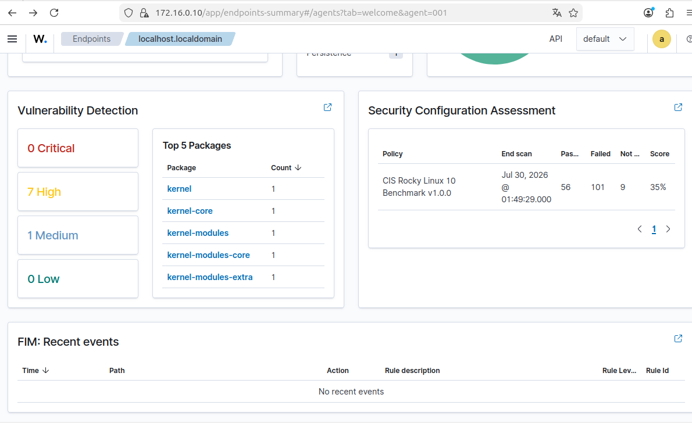

# Wazuh SIEM Setup and First Detection

## Date

July 30 2026 02:00 AM

## Objective

As part of my Blue Team Journey I needed to install a SIEM monitorization. Because up until now what I had configured
and installed was just an attack/victim system to perform pentesting, which wasn't really my objective.

Now with the SIEM installed I can scan my systems to check for vulnerabilities, to configure alarms and simulate more
precisely how to detect and report said alerts, even to distinguish between a mere false alarm and a real alert.

## Wazuh Installation

For my SIEM system I used Ubuntu Desktop 24 LTS, allowing me to have a graphic interface to interact with Wazuh
dashboard and also to allow me to see for myself every part of said dashboards: Agents, deployments, how do they
work and even how to detect what is important on the dashboard.

The version I used for Wazuh is the Wazuh 4.14, which is one of the still supported versions, allowing me to keep
updating the SIEM so it's up to date with the latest cybersecurity reports regarding CVEs and that everything works
according to how it's supposed to.

With the installation I finished checking there were several services getting installed for the dashboard to work:
First the wazuh-indexer, which was the central engine.

This service storaged, indexed and sorted the alerts generated by the server.

Next was the manager. Wazuh-manager. This worked as the central processing unit for the platform, receiving, checking
and processing the data and logs in a secure maner as they get sent by the agents on the servers.

Last was the dashboard, which is the graphical interface I end up interacting with the most, as it holds all the info
received by the other two components and interprets it in a way which is easy an intuitive to check by the SOC members

## Network Configuration

During the configuration of the SIEM system I came to a new issue. My laptop had to be on the same network as the
victim system so it can receive the reports from the agent, but it also had to be able to access the internet
to be able to install directy Wazuh.

For that I allowed one internal network interface and a NAT interface on my system, so it wan't able to affect my
domestic devices and only access the internet for the needed cases.

That also meant I had to add a NAT interface on the Rocky linux server because during the agent deployment the
installation needed internet connection.

## Agent Deployment - Rocky Linux

Once the dashboard was ready I checked how to install the agents to start receiving information from them so that I
could check for alerts or issues.

First I chose the system I was installing it into (Linux, Windows or mac) then the way to install (RPM or DEB) and
the architecture of the system (Aarch64 or AMD64).

Then I gave the form the wazuh-server's IP address, and so the agent configuration gave me the correct commands to
install said agents on other machines.

Once the download was completed on the server, I installed the agent and configured it so it reported to the
wazuh-manager on my SIEM server.

## First Detection - Vulnerability Scan

Now that everything was firstly set up was the time to get a first analysis of my production server. I checked the
report given by the agent on Rocky Linux and saw there were no alerts, since there were not a single one configured
yet.

However Wazuh reported vulnerabilities as well, not only alerts. It reported 1 medium vulnerability and 7 high.
Upon further inspection the 7 high vulnerabilities were reported in the [CVE-2024-56645 - Red Hat advisory](https://access.redhat.com/security/cve/cve-2024-56645)

As reported on December 27th 2024, this vulnerability was related to a memory leak, which caused degradation of
services or even crashes, not to be allowed on production servers.

Red Hat Enterprises also reported that this vulnerability has been fixed in RHEL 9 on November 11th 2025 update
and RHEL 10 on May 28th 2026.

As this kind of vulnerabilities require an update and for that, a downtime, it is not in my duties to perform the
corresponding updates, but to escalate this situatio to L2 or even directly to the security engineer for him and
the sysadmin to schedule the update and restart of the affected servers.

## Screenshots

