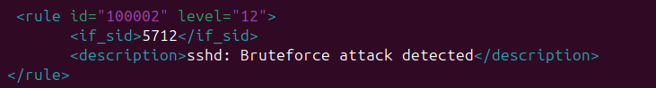
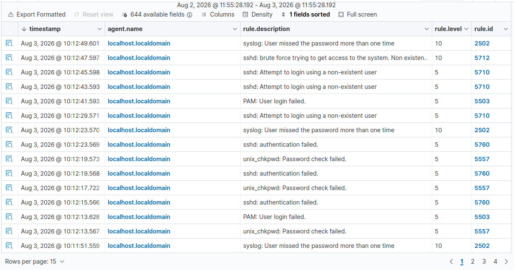
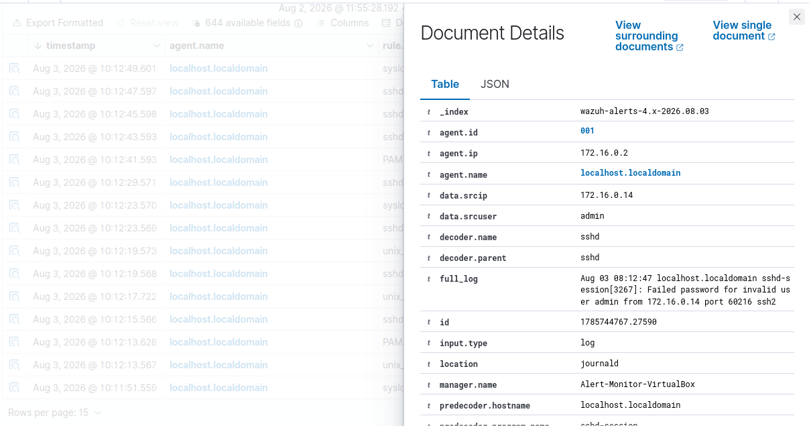
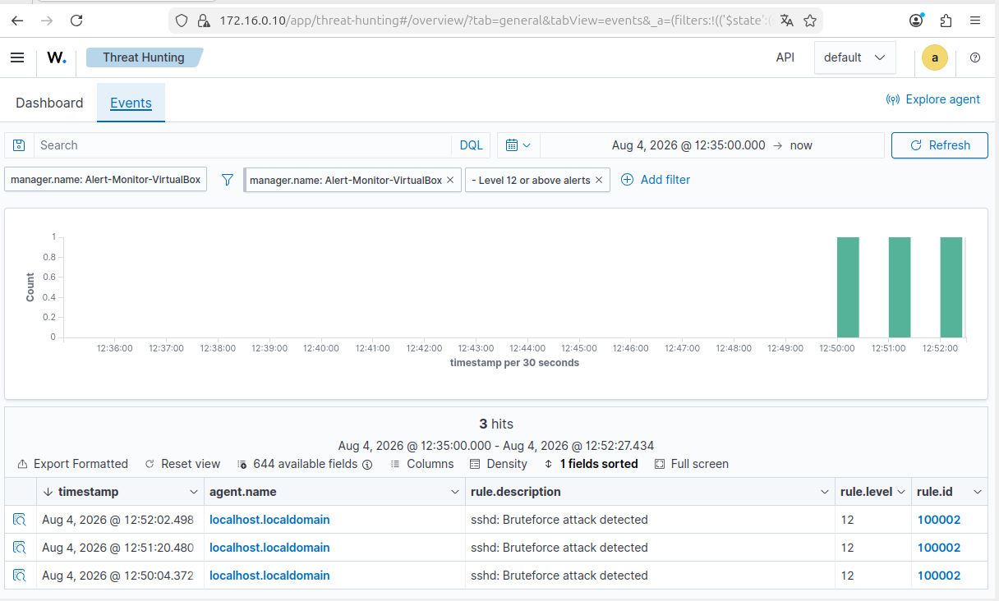

# SSH Bruteforce Detection

## Date of Detection

- August 3rd 2026

## Used tools

- From attacker's side: Nmap to detect ports/scans and ssh to try and connect as reported on 01-nmap-reconnaissance.md

- From defender's side: Wazuh dashboard on Ubuntu 24 LTS and Wazuh agent on Rocky Linux.

## Detected Events

- From August 3rd 2026 at 10:11 to 10:12 there were several alerts regarding sshd:attempt to login using a
non-existent user, PAM: User Login Failed, syslog: User missed the password more than one time, unix_chkpwd:
Password Check Failed and lastly sshd: Brute force trying to get access to system.

From our perspective these alerts inform us that a machine is constantly trying to access the production
server trying to check which users exists actually and checking for differents passwords until the Wazuh
SIEM flagged the constant trying as a bruteforce attack.

- (Bruteforce: The constant try of stablishing a connection by using login credentials invented or guessed
from the usual suspects. Tends to be done automatically done by a tool)

## IPs

- Agent IP: 172.16.0.2 - Rocky Linux

- Attacker IP: 172.16.0.14 - Kali Linux. This meets the screenshots at the bottom of the documents.

## Actions from Analyst POV.

From the analyst's perspective the first action needed is to raise the incident, escalate such incident to L2
team and flag the alert as the system itself flagged it as a bruteforce attack.

Now if the analyst had the required permissions to modify the firewalls rules the next proceeding step is to
block the IP (172.16.0.14 on this case) and apply them so all the connection tries get blocked and can't
reach the server.

Lastly document everything in the corresponding playbook, document and/or register it on the database to be
checked by other colleagues in similar cases.

## Custom Rule - 100002

- As per this homelab characteristics (low security & vulnerable password for production server) I proceeded to create
a custom rule for Wazuh 'Bruteforce attack detected'

This meant that every time Wazuh detected a bruteforce attack on the production server it would raise high alert easy
to filter between all the other generated events.

- The reason behind the choosen priority/alert level was because a system with his kind of characteristics needed a
high alert on bruteforce attacks, as the default event 5712 was level 10 and medium in consideration, something to
help filter it between all the other alerts makes a supposed SOC analyst's job better.

- And now that I mentioned 5712. This event id is the default rule for bruteforce attacks, but with an id that moves
between the default values it's easier to miss, and the priority given to it as medium. So when Wazuh detects a 5712
event it also raises a custom 100002 alarm.
 
## Screenshots

