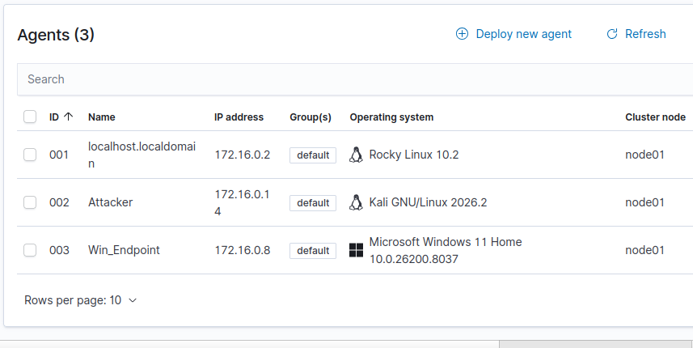
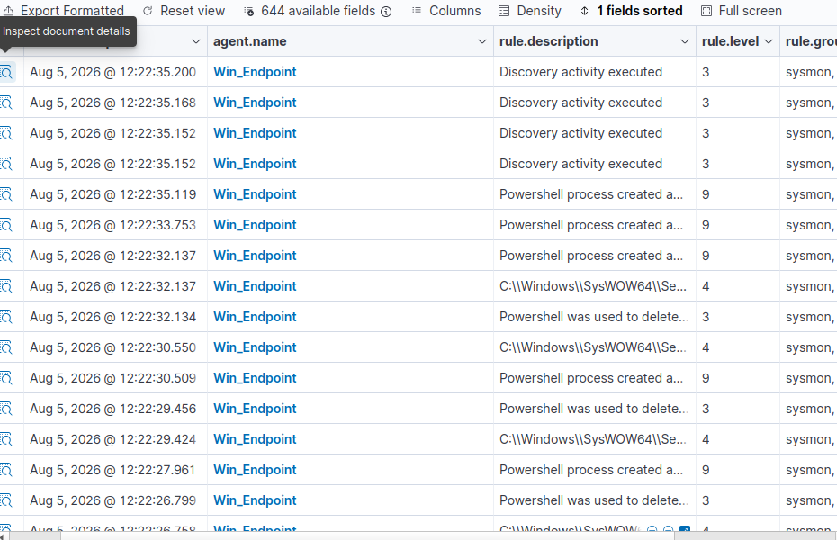
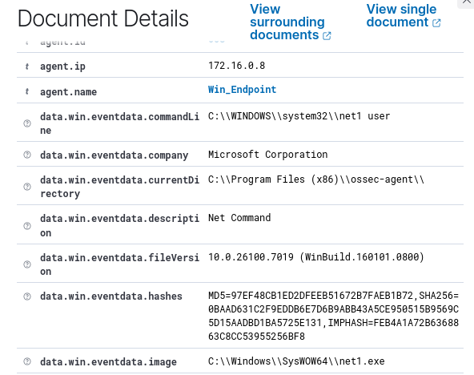

# Windows Endpoint Setup - Sysmon and Wazuh

Document to report the installation and configuration of sysmon and finally the inclusion of a windows enpoint machine to the homelab.

## Date
Aug 5 2026 13:46

## Objective
Most of the users (private and business users) use windows laptops or computer as their personal laptops with so much info about them in then: Passwords, bank accounts or info, credit card info and or personal info saved up.

The objective of this activity of the homelab is to learn what is Sysmon and how does the info picked up by sysmon in logs appear on Wazuh agents.

## Sysmon Installation

The sysmon installation wasn't really an issue, as the documentation was plenty and very available:

Sysmon itself is to be downloaded from the official Microsoft Sisinternals webpage.
What makes it a little bit tricky is that sysmon picks up logs for everything, so I needed to clean the noise to reveal
what was truly important for a SOC analyst. So I had to pickup a configuration file.
The configuration file I picked up was SwiftOnSecurity, the most used sysmon configuration, downloading it directly
from the official github project page.

To install both I started by executing the installation of sysmon from an admin powershell window, and then applying the configuration .xml file for it to be copied.

Finally to verify the installation and configuration of Sysmon I went to the event log and checked Applications and Service logs -> Microsoft -> Windows -> Sysmon -> Operational.

Once completed, I proceeded to configure the Wazuh agent for Windows.

## Wazuh Agent Deployment - Windows

The wazuh agent deployment was not a difficult task as Wazuh generates the corresponding command for you to execute regarding your system.
Once the command was generated I pasted it in an admin powershell, and once finished, executed NET start WazuhSvc.

That started the Wazuh agent and made it report to the wazuh platform completely over the course of a minute.

## Sysmon Log Integration with Wazuh.

However Sysmon logs are not correctly integrated in Wazuh agent by themselves, as they are an addition that comes not from the system itself, but from a tool.

This meant that at first moment, sysmon was not reporting back to wazuh, and that had to be fixed.

To fix this I got into C:\Program_Files_(x86)\ossec-agent\ossec.conf and open it in an admin session notepad.
Then I checked the localfiles and added the following line:

```xml
<localfile>
	<location>Microsoft-Windows-Sysmon/Operational</location>
	<log_format>eventchannel</log_format>
</localfile>
```

With this sysmon just needed a restart to apply this new info and from that moment on, Wazuh received the sysmon logs.

## First Sysmon Event Analysis.

And now we arrive at the first Sysmon Event I picked at Wazuh event viewer for that same host.

And the important part, what that event informed about.

First: The alert informed about was the use of the command NET.
this was obviously a fake alert, as I had to use NET to start Wazuh-agent, and that was what the agent picked up from sysmon.

Net1 or NET Start was the command in question, used by a user in the system.
But with this, I had such a broader scope of alerts to check, which meant that my challenge would be to distinguish now even further from fake or true alerts.

Lastly, a bit of a reflection about this event... If I found this action being executed on an endpoint computer at 3AM I would raise an alarm and report it following the corresponding procedure: Detect, Triage, Escalate and contain.

Detect: Detected the incident/alert, the first step, seeing a suspicious activity at 3AM log time on a computer screen
when supposedly no one is on site or no one should be accessing that computer.

Triage: Check with the user, trying to contact them or to contact the site to check if someone is there, if the user
is actively working instead of having left the laptop open for everyone to use forgotten in site.

Escalate: After finding out there is no response I would escalate the incident to L2.

Contain: I would try to isolate the laptop in the network or contact someone from network team or system team to try and close the session or directly order the computer to shut down
before further testings.

This kind of attack would be most likely an account discovery (MITRE ATT&CK T1087), which would be on the phase of the
attacker trying to find the privileges the user has or the permissions it has to execute commands on this case, but on
others it also looks for other accounts.

Most of the attackers use it to try and find domain admins or root operators, plan brute-force attacks, credential dumping or phishing campaings.
And this is also a good way for them to blend in, so the earlier it's discovered, the sooner can be contained and prevented.


## Screenshots

Agent Summary



Sysmon Events



Sysmon Event Details


